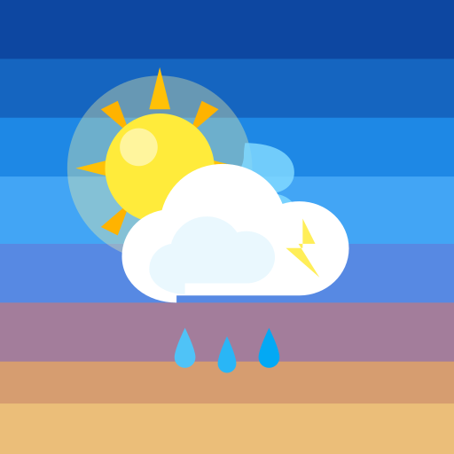
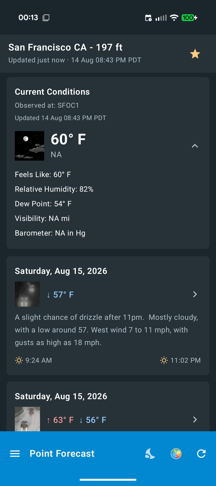
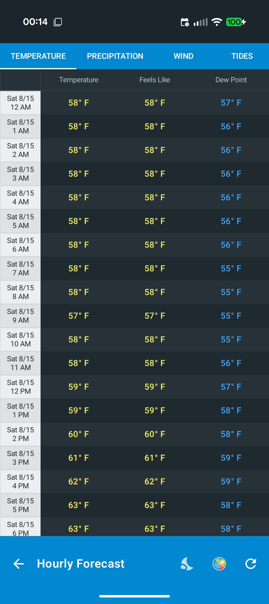
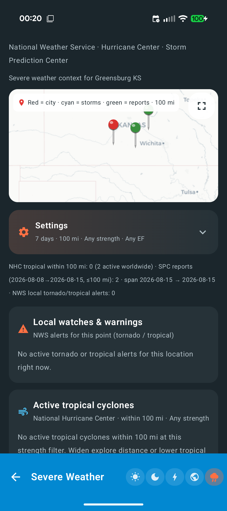
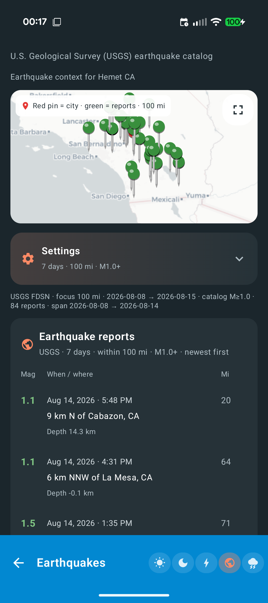
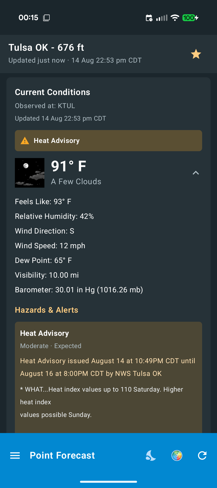
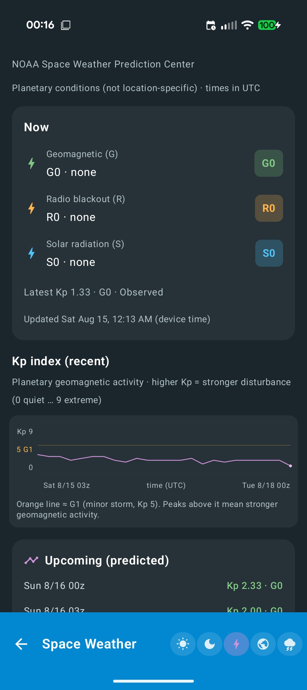
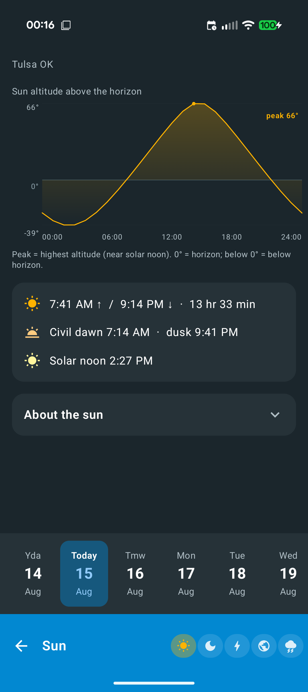
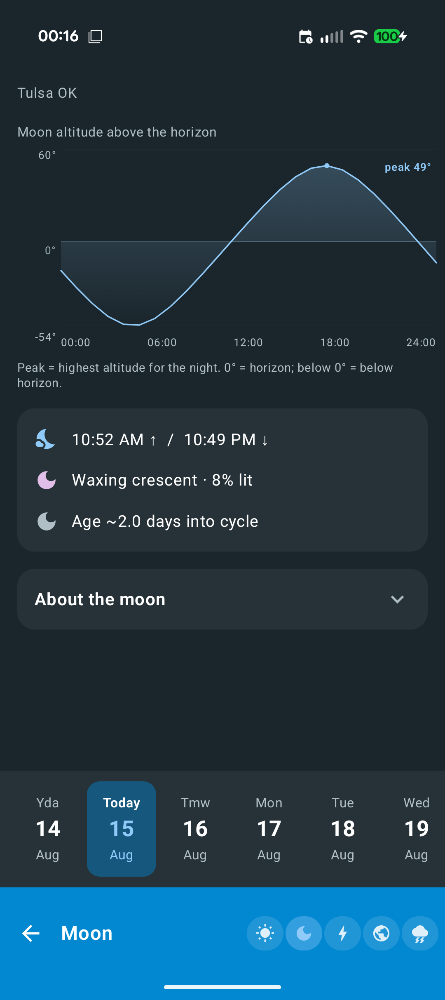

<p align="center">
  
</p>

<h1 align="center">Point Forecast</h1>

<p align="center">
  <strong>U.S. National Weather Service point forecasts</strong> on Android — clear, private, and fully open source.
</p>

<p align="center">
  <a href="https://f-droid.org/packages/com.crome.forecastpoint/"></a>
  <a href="https://github.com/crome1394/point-forecast/releases/latest"></a>
  
  
  <a href="LICENSE"></a>
  <a href="https://buymeacoffee.com/crome1394"></a>
</p>

<p align="center">
  <em>Not affiliated with NOAA, NWS, or any commercial weather app.</em> Public APIs only.
</p>

<p align="center">
  <a href="https://f-droid.org/packages/com.crome.forecastpoint/"></a>
  &nbsp;
  <a href="https://buymeacoffee.com/crome1394"></a>
</p>

## Screenshots

<p align="center">
  
  
  
  
</p>

<p align="center">
  
  
  
  
</p>

## Features

- **Current conditions** and multi-day NWS forecast (pull-to-refresh)
- **Hourly** tables you can reorder: temperature, precip, wind, tides / water level, air quality, visibility, pressure, UV, space weather
- **Alerts** for watches, warnings, and advisories
- **Map** location pick (OpenStreetMap / osmdroid — no Google Play Services) plus city search
- **Radar** via weather.gov from the app bar
- **Sun / moon / space weather / earthquakes / severe weather** hub
  - Hazard maps with push-pin markers, explore radius, and history windows
  - Tropical cyclone + tornado filters
- **Home screen widget** with bundled NWS icons (works well on CalyxOS)
- **Settings** for title bar, hourly tabs, drawer, map focus radius, hazard defaults, and more

| | |
|---|---|
| **App ID** | `com.crome.forecastpoint` |
| **Android** | 8.0+ (API 26) |
| **License** | [MIT](LICENSE) |
| **Code** | [`forecast-point/`](forecast-point/) |

## Download

- **[F-Droid](https://f-droid.org/packages/com.crome.forecastpoint/)** — recommended; developer-signed reproducible builds
- **[GitHub Releases](https://github.com/crome1394/point-forecast/releases)** — same signing key as F-Droid (`app-release-signed.apk`)

```bash
adb install -r app-release-signed.apk
```

> **Note:** If you installed an early F-Droid build (before 1.1.9), uninstall once and reinstall so Android accepts the developer signing key.

## Support the project

If Point Forecast is useful to you, you can fuel future updates here:

<p>
  <a href="https://buymeacoffee.com/crome1394"></a>
</p>

[buymeacoffee.com/crome1394](https://buymeacoffee.com/crome1394)

## Build

**Needs:** JDK 17+, Android SDK.

```bash
cd forecast-point
./gradlew :app:assembleRelease   # or :app:assembleDebug
```

Output: `app/build/outputs/apk/…/app-*.apk`

Signed / F-Droid releases: see [RELEASE.md](RELEASE.md) and [docs/REPRODUCIBLE_BUILDS.md](docs/REPRODUCIBLE_BUILDS.md).

## Specs

| | |
|---|---|
| Language | Kotlin |
| UI | Jetpack Compose |
| Min / target SDK | 26 / 35 |
| Maps | osmdroid + OpenStreetMap tiles (no Google Play Services) |

## Data sources

| Data | Source |
|------|--------|
| Forecast, observations, alerts | NWS (`weather.gov`, `api.weather.gov`) |
| Tides / water levels | NOAA CO-OPS; USGS NWIS stage |
| Space weather (Kp / G/R/S) | NOAA SWPC |
| Earthquakes | USGS Earthquake Hazards Program (FDSN) |
| Severe weather | SPC reports + WCM; NHC CurrentStorms; NWS CAP |
| Air quality, UV, pressure | [Open-Meteo](https://open-meteo.com/) (optional) |
| Search / map | Nominatim + OpenStreetMap tiles |

Coverage for core forecast is **U.S. NWS points**.

## Privacy

No accounts. **No analytics, ads, or crash-reporting SDKs.** Location is used only when you choose GPS, map, or search. HTTPS only to the public services above. Full policy: [PRIVACY.md](PRIVACY.md).

## F-Droid / free software

- Source: this repository (MIT)
- No proprietary Google Play Services; maps via **osmdroid**
- Reproducible upstream-signed builds: [docs/REPRODUCIBLE_BUILDS.md](docs/REPRODUCIBLE_BUILDS.md)
- Sample metadata: [metadata/com.crome.forecastpoint.yml](metadata/com.crome.forecastpoint.yml)

## Contributing

See [CONTRIBUTING.md](CONTRIBUTING.md). Release steps: [RELEASE.md](RELEASE.md). Credits: [NOTICE](NOTICE).

## License

[MIT](LICENSE). Third-party data and libraries keep their own terms ([NOTICE](NOTICE)).
